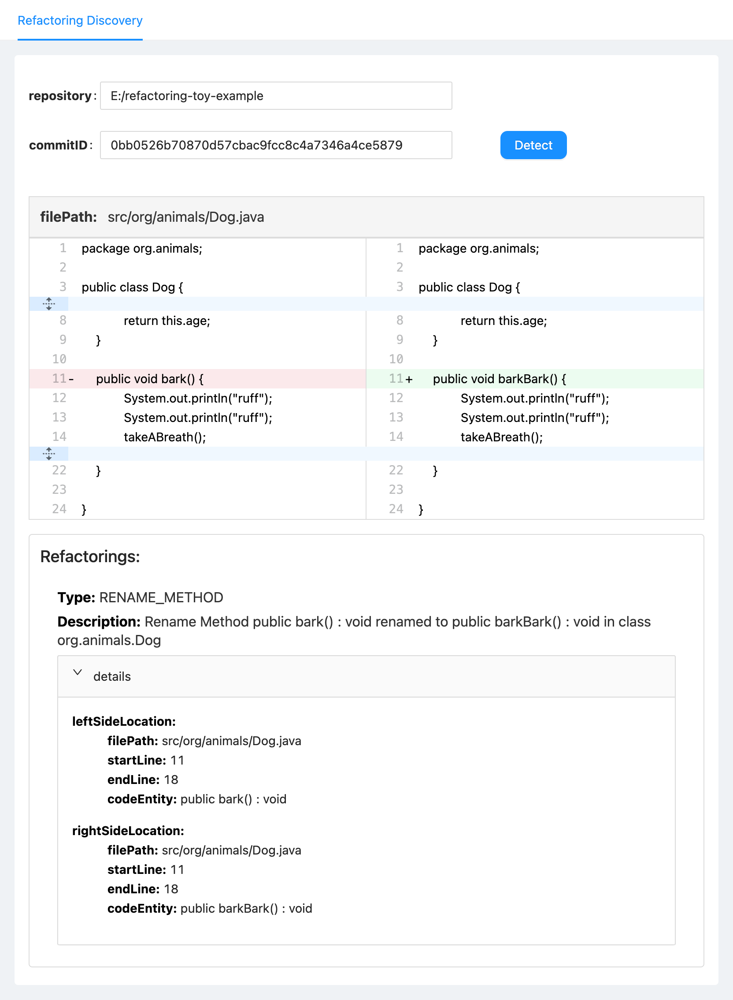

Table of Contents
=================

* [General info](#general-info)
* [Requirements](#requirements)
* [API usage guidelines](#api-usage-guidelines)
* [Location information](#location-information)
* [How to build and run](#how-to-build-and-run)
     * [Command line](#command-line)
     * [IntelliJ IDEA](#intellij-idea)
* [How to add as a Maven dependency](#how-to-add-as-a-maven-dependency)
* [Tool](#tool)


# General info
ReExtractor is a library/API written in Java that can detect refactorings applied between two successive versions of a Java project.

Currently, it supports the detection of the following refactorings:

**<ins>supported by ReExtractor 1.0 and newer versions</ins>**

1. Rename Method
2. Rename Attribute
3. Rename Class
4. Move Class
5. Extract Class
6. Extract Method
7. Inline Method
8. Change Return Type
9. Change Attribute Type

**<ins>supported by ReExtractor 1.1 and newer versions</ins>**

10. Move Method
11. Move Attribute
12. Pull Up Method
13. Pull Up Attribute
14. Push Down Method
15. Push Down Attribute
16. Extract Superclass
17. Extract Interface
18. Extract and Move Method
19. Move and Rename Class
20. Extract Subclass
21. Extract Variable
22. Inline Variable
23. Rename Variable
24. Rename Parameter
25. Move and Rename Attribute
26. Change Variable Type
27. Change Parameter Type
28. Move and Rename Method
29. Move and Inline Method
30. Add Method Annotation
31. Remove Method Annotation
32. Modify Method Annotation
33. Add Attribute Annotation
34. Remove Attribute Annotation
35. Modify Attribute Annotation
36. Add Class Annotation
37. Remove Class Annotation
38. Modify Class Annotation
39. Add Parameter Annotation
40. Remove Parameter Annotation
41. Modify Parameter Annotation
42. Add Variable Annotation
43. Remove Variable Annotation
44. Modify Variable Annotation
45. Add Parameter
46. Remove Parameter
47. Reorder Parameter
48. Add Thrown Exception Type
49. Remove Thrown Exception Type
50. Change Thrown Exception Type
51. Change Method Access Modifier
52. Change Attribute Access Modifier
53. Add Method Modifier (`final`, `static`, `abstract`, `synchronized`)
54. Remove Method Modifier (`final`, `static`, `abstract`, `synchronized`)
55. Add Attribute Modifier (`final`, `static`, `transient`, `volatile`)
56. Remove Attribute Modifier (`final`, `static`, `transient`, `volatile`)
57. Add Variable Modifier (`final`)
58. Add Parameter Modifier (`final`)
59. Remove Variable Modifier (`final`)
60. Remove Parameter Modifier (`final`)
61. Change Class Access Modifier
62. Add Class Modifier (`final`, `static`, `abstract`)
63. Remove Class Modifier (`final`, `static`, `abstract`)
64. Change Type Declaration Kind (`class`, `interface`, `enum`)
65. Replace Loop with Pipeline
66. Replace Anonymous with Lambda
67. Replace Pipeline with Loop
68. Split Conditional
69. Invert Condition
70. Merge Conditional
71. Change Loop Type *
72. Merge Declaration and Assignment *
73. Replace if with Ternary Operator *
75. Loop Interchange *

&nbsp;&nbsp;\* not supported by other refactoring detection tools

# Requirements

**Java 17** or newer

**Apache Maven 3.8** or newer

# API usage guidelines

ReExtractor can automatically detect refactorings between two successive versions of a git repository.

In the code snippet below we demonstrate how to print all refactorings performed at a specific commit in the toy project https://github.com/danilofes/refactoring-toy-example.git. The commit is identified by its SHA key, such as in the example below:

```java
GitService gitService = new GitServiceImpl();
try (Repository repo = gitService.openRepository("E:/refactoring-toy-example")) {
  RefactoringExtractorService extractor = new RefactoringExtractorServiceImpl();
  extractor.detectAtCommit(repo, "d4bce13a443cf12da40a77c16c1e591f4f985b47", new RefactoringHandler() {
    @Override
    public void handle(String commitId, List<Refactoring> refactorings) {
      System.out.println("Refactorings at " + commitId);
      for (Refactoring ref : refactorings) {
        System.out.println(ref.toString());
      }
    }
      
    @Override
    public void handleException(String commit, Exception e) {
      System.err.println("Error processing commit " + commit);
      e.printStackTrace(System.err);
    }
  });
}
```

# Location information
All classes implementing the `Refactoring` interface include refactoring-specific location information.
For example, `ExtractOperationRefactoring` offers the following methods:

1. `getSourceOperationBeforeExtraction()` : Returns the code entity associated with the source method in the **parent** commit
2. `getSourceOperationAfterExtraction()` : Returns the code entity associated with the source method in the **child** commit
3. `getExtractedOperation()` : Returns the code entity associated with the extracted method in the **child** commit

Each code entity offers the `LocationInfo getLocation()` method to return a `LocationInfo` object including the following properties:

```java
String filePath
int startLine
int endLine
int startColumn
int endColumn
```

Alternatively, you can use the methods `LocationInfo leftSide()` and `LocationInfo rightSide()` to get the `LocationInfo` objects for the left side (i.e., **parent** commit)  and the right side (i.e., **child** commit) of the refactoring, respectively.

# How to build and run

## Command line

1. **Clone repository**

   `git clone https://github.com/lyoubo/ReExtractor.git`

2. **Cd  in the locally cloned repository folder**

   `cd ReExtractor`

3. **Build ReExtractor**

   `mvn install`

4. **Run the API usage example shown in README**

   `mvn compile exec:java -Dexec.mainClass="org.reextractor.ReExtractor" -Dexec.args="-c refactoring-toy-example d4bce13a443cf12da40a77c16c1e591f4f985b47"`

## IntelliJ IDEA

1. **Clone repository**

   `git clone https://github.com/lyoubo/ReExtractor.git`

2. **Import project**

   Go to *File* -> *Open...*

   Browse to the root directory of project ReExtractor

   Click *OK*

   The project will be built automatically.

3. **Run the API usage examples shown in README**

   From the Project tab navigate to `org.reextractor.ReExtractor`

   Right-click on the file and select *Run ReExtractor.main()*

**You can add the `-json <path-to-json-file>` command arguments to save the JSON output in a file. The results are appended to the file after each processed commit.**

In both cases, you will get the output in JSON format:

    {
      "results": [
        {
          "repository": "https://github.com/danilofes/refactoring-toy-example.git",
          "sha1": "d4bce13a443cf12da40a77c16c1e591f4f985b47",
          "url": "https://github.com/danilofes/refactoring-toy-example/commit/d4bce13a443cf12da40a77c16c1e591f4f985b47",
          "refactorings": [
            {
              "type": "MOVE_OPERATION",
              "description": "Move Method	public barkBark(manager DogManager) : void from class org.animals.Dog to public barkBark(dog Dog) : void from class org.DogManager",
              "leftSideLocation": [
                {
                  "filePath": "src/org/animals/Dog.java",
                  "startLine": 14,
                  "endLine": 21,
                  "startColumn": 2,
                  "endColumn": 3,
                  "codeElementType": "METHOD_DECLARATION",
                  "description": "original method declaration",
                  "codeElement": "public barkBark(manager DogManager) : void"
                }
              ],
              "rightSideLocation": [
                {
                  "filePath": "src/org/DogManager.java",
                  "startLine": 25,
                  "endLine": 32,
                  "startColumn": 2,
                  "endColumn": 3,
                  "codeElementType": "METHOD_DECLARATION",
                  "description": "moved method declaration",
                  "codeElement": "public barkBark(dog Dog) : void"
                }
              ]
            },
            {
              "type": "RENAME_PARAMETER",
              "description": "Rename Parameter	manager : DogManager to dog : Dog in method public barkBark(dog Dog) : void from class org.DogManager",
              "leftSideLocation": [
                {
                  "filePath": "src/org/animals/Dog.java",
                  "startLine": 14,
                  "endLine": 14,
                  "startColumn": 23,
                  "endColumn": 41,
                  "codeElementType": "SINGLE_VARIABLE_DECLARATION",
                  "description": "original variable declaration",
                  "codeElement": "manager : DogManager"
                },
                {
                  "filePath": "src/org/animals/Dog.java",
                  "startLine": 14,
                  "endLine": 21,
                  "startColumn": 2,
                  "endColumn": 3,
                  "codeElementType": "METHOD_DECLARATION",
                  "description": "original method declaration",
                  "codeElement": "public barkBark(manager DogManager) : void"
                }
              ],
              "rightSideLocation": [
                {
                  "filePath": "src/org/DogManager.java",
                  "startLine": 25,
                  "endLine": 25,
                  "startColumn": 23,
                  "endColumn": 30,
                  "codeElementType": "SINGLE_VARIABLE_DECLARATION",
                  "description": "renamed variable declaration",
                  "codeElement": "dog : Dog"
                },
                {
                  "filePath": "src/org/DogManager.java",
                  "startLine": 25,
                  "endLine": 32,
                  "startColumn": 2,
                  "endColumn": 3,
                  "codeElementType": "METHOD_DECLARATION",
                  "description": "method declaration with renamed variable",
                  "codeElement": "public barkBark(dog Dog) : void"
                }
              ]
            },
            {
              "type": "CHANGE_PARAMETER_TYPE",
              "description": "Change Parameter Type	manager : DogManager to dog : Dog in method public barkBark(dog Dog) : void from class org.DogManager",
              "leftSideLocation": [
                {
                  "filePath": "src/org/animals/Dog.java",
                  "startLine": 14,
                  "endLine": 14,
                  "startColumn": 23,
                  "endColumn": 41,
                  "codeElementType": "SINGLE_VARIABLE_DECLARATION",
                  "description": "original variable declaration",
                  "codeElement": "manager : DogManager"
                },
                {
                  "filePath": "src/org/animals/Dog.java",
                  "startLine": 14,
                  "endLine": 21,
                  "startColumn": 2,
                  "endColumn": 3,
                  "codeElementType": "METHOD_DECLARATION",
                  "description": "original method declaration",
                  "codeElement": "public barkBark(manager DogManager) : void"
                }
              ],
              "rightSideLocation": [
                {
                  "filePath": "src/org/DogManager.java",
                  "startLine": 25,
                  "endLine": 25,
                  "startColumn": 23,
                  "endColumn": 30,
                  "codeElementType": "SINGLE_VARIABLE_DECLARATION",
                  "description": "changed-type variable declaration",
                  "codeElement": "dog : Dog"
                },
                {
                  "filePath": "src/org/DogManager.java",
                  "startLine": 25,
                  "endLine": 32,
                  "startColumn": 2,
                  "endColumn": 3,
                  "codeElementType": "METHOD_DECLARATION",
                  "description": "method declaration with changed variable type",
                  "codeElement": "public barkBark(dog Dog) : void"
                }
              ]
            }
          ]
        }
      ]
    }

# How to add as a maven dependency

[](https://maven-badges.herokuapp.com/maven-central/io.github.lyoubo/refactoring-extractor)

To add ReExtractor as a maven dependency in your project, add the following snippet to your project's pom.xml:

    <dependency>
      <groupId>io.github.lyoubo</groupId>
      <artifactId>refactoring-extractor</artifactId>
      <version>2.1.1</version>
    </dependency>

# Tool

To get refactoring information when inspecting a commit of a Java project, you can use our [RefactoringExtractor tool](tool/).

- Git Repository: Local or cloned Java project
- Commit SHA1: Git commit ID
- JSON File Path: JSON output file


